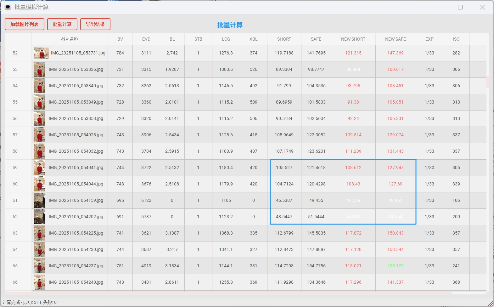

## 展锐ae5.0辅助调试工具

**Aebox**是一款多功能ae辅助调试工具集合，采用 **Python + PyQt5** 实现，旨在为AE模块的同事提供丰富的辅助调试的工具，提高ae模块的调试效率，降低ae模块的上手难度。

  
  
    
  </a>
    

# 下载请查看最新的release
>[ https://github.com/965962591/aebox_unisoc_releases/releases](https://github.com/965962591/aebox_unisoc_release/releases)

### 主界面

#### 模拟计算

#### 批量计算

##### 使用指南
- 首先设置iqt.exe路径，使用vivi magic工具版本必须高于3603   路径举例：D:\tuning\ViviMagic_TOOL_V1.0_3903\plugins\3aTool
- 设置测试图片文件路径（批量查看和解析图片）
- 点击“解析”来调用平台工具解析数据并展示AE相关相关调试信息
